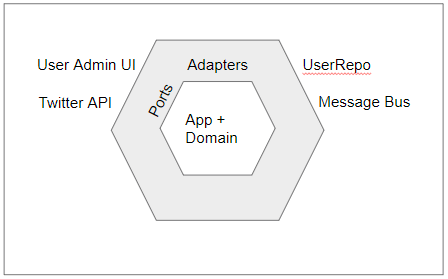
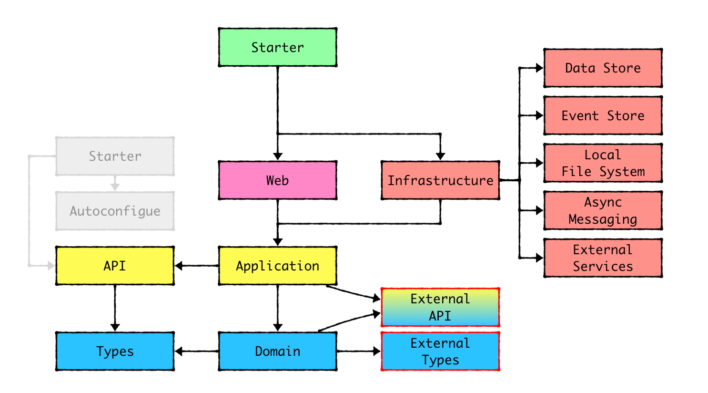
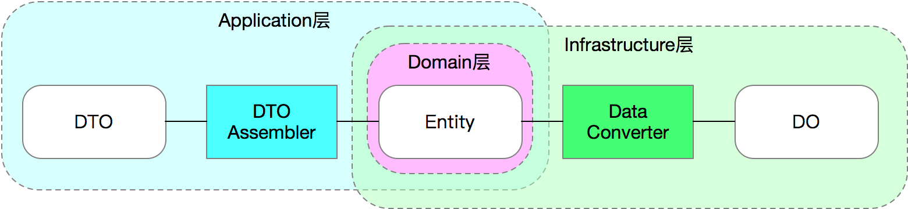

### 目标，解决传统架构中的问题
ddd 打破了传统的上、下分层的概念把所有的输入、输出理解成为I/O模型，外加应用业务的核心逻辑
1. I/O的具体实现在模型的最外层
2. 每个I/O的适配器在灰色地带
3. 每个Hex的边是一个端口
4. Hex的中央是应用的核心领域模型

代码结构清晰：通过POM module可以解决模块间的依赖关系，
所有外接模块都可以单独独立成Jar包被复用。当团队形成规范后，可以快速的定位到相关代码。
1. 高可维护性：当外部依赖变更时，内部代码只用变更跟外部对接的模块，其他业务逻辑不变。
2. 高可扩展性：做新功能时，绝大部分的代码都能复用，仅需要增加核心业务逻辑即可。
3. 高可测试性：每个拆分出来的模块都符合单一性原则，绝大部分不依赖框架，可以快速的单元测试，做到100%覆盖。
4. 代码结构清晰：通过POM module可以解决模块间的依赖关系，
   所有外接模块都可以单独独立成Jar包被复用。当团队形成规范后，可以快速的定位到相关代码。

#### 目录结构

#### 1. Entity \ Do \ Dto 之间的关系
1. Data Object数据类：AccountDO是单纯的和数据库表的映射关系，每个字段对应数据库表的一个column，这种对象叫Data Object。
2. Entity实体类：基于领域逻辑的实体类，它的字段和数据库储存不需要有必然的联系。Entity包含数据，同时也应该包含行为。Domain Primitive代替，可以避免大量的校验代码。
3. DTO（传输对象）：主要作为Application层的入参和出参，比如CQRS里的Command、Query、Event，以及Request、Response等都属于DTO的范畴。DTO的价值在于适配不同的业务场景的入参和出参，避免让业务对象变成一个万能大对象。

#### 模型转换

1. DTO Assembler：在Application层，Entity到DTO的转化器有一个标准的名称叫DTO Assembler。Martin Fowler在P of EAA一书里对于DTO 和 Assembler的描述：Data Transfer Object。DTO Assembler的核心作用就是将1个或多个相关联的Entity转化为1个或多个DTO。

2. Data Converter：在Infrastructure层，Entity到DO的转化器没有一个标准名称，但是为了区分Data Mapper，我们叫这种转化器Data Converter。

#### 2. DAO \ Repository 之间的关系
1. DAO对应的是一个特定的数据库类型的操作，相当于SQL的封装。所有操作的对象都是DO类，所有接口都可以根据数据库实现的不同而改变。比如，insert 和 update 属于数据库专属的操作。
2. Repository对应的是Entity对象读取储存的抽象，在接口层面做统一，不关注底层实现。Repository的具体实现类通过调用DAO来实现各种操作，通过Builder/Factory对象实现AccountDO 到 Account之间的转化

#### 3. Repository和Entity
1. 通过核心对象的转换操作，避免了与数据库代码的自己耦合。
2. 由面向db编程调整为面向接口方式编程
3. 核心对象《Entity》 存在于内存，对测试友好
4. Repository 面向接口方式编程，可以更好的使用mock
5. Repository 每个实现类 可以理解为一个单一的实现（单一职责）

#### ACL 层

#### Web
1. Web模块包含Controller等相关代码。如果用SpringMVC则需要依赖Spring。

#### Application
1. Application模块主要包含Application Service和一些相关的类。Application模块依赖Domain模块。还是不依赖任何框架，纯POJO。

#### Infrastructure 层 ，下面三个模块也可以理解为是一个acl
1. 包含了Persistence、Messaging、External等模块
2. Persistence模块包含数据库DAO的实现，包含Data Object、ORM Mapper、Entity到DO的转化类等。Persistence模块要依赖具体的ORM类库，比如MyBatis。
3. Messaging外部消息通信
4. External 依赖外部服务

#### Domain 
1. 核心业务逻辑的集中地，包含有状态的Entity、领域服务Domain Service、以及各种外部依赖的接口类（如Repository、ACL、中间件等。Domain模块仅依赖Types模块，也是纯POJO。

### 测试
1. Types，Domain模块都属于无外部依赖的纯POJO，基本上都可以100%的被单元测试覆盖。 
2. Application模块的代码依赖外部抽象类，需要通过测试框架去Mock所有外部依赖，但仍然可以100%被单元测试。 
3. Infrastructure的每个模块的代码相对独立，接口数量比较少，相对比较容易写单测。但是由于依赖了外部I/O，速度上不可能很快，但好在模块的变动不会很频繁，属于一劳永逸。 
4. Web模块有两种测试方法：通过Spring的MockMVC测试，或者通过HttpClient调用接口测试。但是在测试时最好把Controller依赖的服务类都Mock掉。一般来说当你把Controller的逻辑都后置到Application Service中时，Controller的逻辑变得极为简单，很容易100%覆盖。 
5. Start模块：通常应用的集成测试写在start里。当其他模块的单元测试都能100%覆盖后，集成测试用来验证整体链路的真实性。

https://developer.aliyun.com/article/713097?spm=a2c6h.12873639.article-detail.88.4ee427c9zRqxVK#slide-7